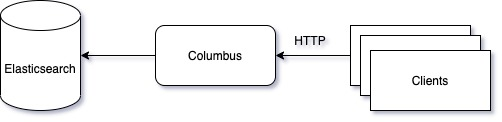

# Architecture

Columbus' architecture is pretty simple. It serves HTTP server with Elasticsearch as its main persistent storage.

## System Design
### Components

#### HTTP Server

* HTTP server is the main and only interface to interact with Columbus using RESTful pattern.

#### Elasticsearch

* Columbus uses Elasticsearch as it is main storage for storing all of its metadata.
