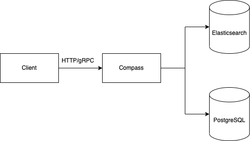

# Architecture

Compass is built as a context engine with a layered architecture. Raw metadata observations flow in, get resolved into unified entities, are stored in a temporal knowledge graph, indexed for hybrid search, and served to both human interfaces and AI agents.

## System Design

### Components

#### Entity Resolver

Incoming metadata observations from collection systems like Meteor are resolved against the existing graph. The resolver deduplicates, merges facets from multiple sources, and maintains stable entity identity. The same logical entity appearing across different systems is recognized and unified.

#### Graph Store (PostgreSQL)

PostgreSQL is the primary store for the knowledge graph. Entities, typed directed edges, and temporal metadata (valid_from/valid_to) are stored relationally. Recursive CTE queries power multi-hop graph traversal for impact analysis and dependency tracking. Row Level Security enforces multi-tenant isolation at the database level.

#### Vector Index (pgvector)

Semantic search is powered by pgvector embeddings stored alongside entities. When an entity is created or updated, Compass generates vector embeddings of its semantic content. This enables similarity-based discovery where keyword search falls short.

#### Search Engine

Compass supports hybrid search combining multiple strategies:

- **Keyword search:** Postgres tsvector full-text search with weighted fields (URN and name weighted highest, descriptions next, source metadata lowest).
- **Fuzzy matching:** pg_trgm trigram indexes for typo-tolerant and partial matching.
- **Semantic search:** pgvector cosine similarity for conceptual matching.
- **Hybrid ranking:** Reciprocal Rank Fusion combines results from keyword and semantic search into a single ranked list.

All search is Postgres-native. There are no external search engine dependencies.

#### Query Engine

The query engine orchestrates graph traversal, hybrid search, and context composition. It handles:

- Multi-hop lineage and dependency traversal
- Impact analysis (what breaks if this changes)
- Context assembly (composing schema, lineage, ownership, and quality signals into a single response)

#### Serving Layer

Compass exposes its capabilities through multiple interfaces:

- **Connect RPC:** The primary API interface, supporting both Connect (HTTP) and gRPC protocols. API definitions are maintained in [raystack/proton](https://github.com/raystack/proton/tree/main/raystack/compass/v1beta1).
- **MCP Server:** Model Context Protocol interface for AI agents. Any MCP-compatible system can connect and use tools like search, lineage traversal, and context assembly.
